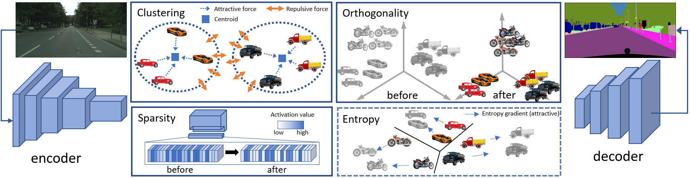

# Unsupervised Domain Adaptation in Semantic Segmentation via Orthogonal and Clustered Embeddings
This is the official PyTorch implementation of our work: "Unsupervised Domain Adaptation in Semantic Segmentation via Orthogonal and Clustered Embeddings" accepted at WACV 2021.

In this paper we propose an effective Unsupervised Domain Adaptation (UDA) strategy, based on feature clustering, orthogonality and sparsity objectives to reach a regularized disposition of latent embeddings , while providing a semantically consistent domain alignment over the feature space. 
We evaluate our framework in the synthetic-to-real scenario, in particular with GTA5, SYNTHIA and Cityscapes datasets.

The webpage of the paper is: [here](https://lttm.dei.unipd.it/paper_data/UDAclustering/)

The 5 minutes presentation video is: [here](https://www.youtube.com/watch?v=mTRimyHe-Vo&feature=youtu.be)

Slides of the presentation are: [here](https://umbertomichieli.github.io/download/slides/slides_2021_WACV.pdf)




## Requirements
This repository uses the following libraries:
- python (3.6)
- pytorch (1.0.0)
- torchvision (0.2.1)
- torchsummary (1.5.1)
- tensorboardX (1.4)
- tqdm (4.26.0)
- imageio (2.1.2)
- numpy (1.14.6)
- pillow (5.3.0)

A guide to install Pytorch can be found [here](https://pytorch.org/).

For an easier installation of the other libraries, we provide you the requirement file to be run
```python
pip install -r requirements.txt
```

## Setup

#### GTA5
Download the [GTA5](https://download.visinf.tu-darmstadt.de/data/from_games/) dataset and place it inside the datasets/GTA5 folder. 
The dataset split is provided within the train.txt and val.txt files in that folder. 

#### Cityscapes
Download the [Cityscapes](https://www.cityscapes-dataset.com/) dataset and place it inside the datasets/Cityscapes folder.
The dataset split is provided within the train.txt, val.txt and test.txt files in that folder. 

#### SYNTHIA  
Download the [SYNTHIA-RAND-CITYSCAPES](http://synthia-dataset.net/downloads/) dataset and place it inside the datasets/SYNTHIA folder.
The dataset split is provided within the train.txt and val.txt files in that folder. 

## Training

### Source Pre-training (example)

GTA5 with ResNet101:

Download the ResNet101's weights pretrained on ImageNet from [here](https://drive.google.com/file/d/1GJzH9dVouqyUNZ4tYAL3VE2iKkGuKBaH/view?usp=sharing) and run
> python tools/train_source.py --backbone "resnet101" --dataset "gta5" --num_classes 19 --checkpoint_dir "./log/gta5-resnet_pretrain/" --iter_max 200000 --iter_stop 80000 --lr 2.5e-4 --crop_size "1280,720"

Alternatively, you can download the GTA5 pretrained weights from [here](https://drive.google.com/file/d/1SnELGaV8qebqpyJ4PC1tKjsH60NszaIt/view?usp=sharing).

### Unsupervised Domain Adaptation

- GTA5-to-Cityscapes with ResNet101:
   > python tools/train_UDA.py --source_dataset "gta5" --num_classes 19 --backbone "resnet101" --round_num 5 --lr 2.5e-4 --lambda_cluster 2e-2 --lambda_ortho 2. --lambda_sparse 5e-1 --lambda_entropy 1e-1 --target_crop_size "1024,512" --crop_size "1280,720"  --checkpoint_dir "./log/gta2city-resnet_UDA/" --pretrained_ckpt_file "./log/gta5-resnet_pretrain/gta5final.pth"

   A checkpoint of the adapted model can be found [here](https://drive.google.com/file/d/1SnELGaV8qebqpyJ4PC1tKjsH60NszaIt/view?usp=sharing).

- GTA5-to-Cityscapes with VGG-16:
   > python tools/train_UDA.py --source_dataset "gta5" --num_classes 19 --backbone "vgg16" --round_num 5 --lr 2.5e-4 --lambda_cluster 1e-1 --lambda_ortho 2e-2 --lambda_sparse 2e-2 --lambda_entropy 2e-2 --target_crop_size "1024,512" --crop_size "1280,720"  --checkpoint_dir "./log/gta2city-vgg_UDA/" --pretrained_ckpt_file "./log/gta5-vgg_pretrain/gta5final.pth"

   A checkpoint of the adapted model can be found [here](https://drive.google.com/file/d/1VIAZCSYQLeZH9bw3cJxnqBbOY0jmsQOr/view?usp=sharing).

- SYNTHIA-to-Cityscapes with ResNet-101:
   > python tools/train_UDA.py --source_dataset "synthia" --num_classes 16 --backbone "resnet101" --round_num 5 --lr 2.5e-4 --lambda_cluster 2e-2 --lambda_ortho 1e-1 --lambda_sparse 1 --lambda_entropy 5e-2 --IW_ratio 0. --target_crop_size "1024,512" --crop_size "1280,760" --checkpoint_dir "./log/sy2city-vgg_UDA/" --pretrained_ckpt_file "./log/synthia-vgg_pretrain/synthiafinal.pth"

   A checkpoint of the adapted model can be found [here](https://drive.google.com/file/d/11azxIZBtAvhUGv9v4Mj-l_txhCbN3qBA/view?usp=sharing).

- SYNTHIA-to-Cityscapes with VGG16:
   > python tools/train_UDA.py --source_dataset "synthia" --num_classes 16 --backbone "vgg16" --round_num 5 --lr 2.5e-4 --lambda_cluster 5e-2 --lambda_ortho 5e-2 --lambda_sparse 2e-2 --lambda_entropy 1e-2 --target_crop_size "1024,512" --crop_size "1280,760" --checkpoint_dir "./log/sy2city-vgg_UDA/" --pretrained_ckpt_file "./log/synthia-vgg_pretrain/synthiafinal.pth"

   A checkpoint of the adapted model can be found [here](https://drive.google.com/file/d/1h8VahuGHV2d5SljWq7xnFNt6IVrH69-V/view?usp=sharing).

### Evaluation (example)

GTA5-to-Cityscapes with ResNet101:
> python tools/evaluate.py --source_dataset "gta5" --num_classes 19 --backbone "resnet101" --split "test" --target_crop_size "1024,512" --checkpoint_dir "./log/eval/gta2city-resnet_UDA/" --pretrained_ckpt_file "./log/gta2city-resnet_UDA/gta52cityscapesfinal.pth"


## Cite us
If you use this repository, please consider to cite

       @inProceedings{toldo2021unsupervised,
       author = {Toldo, Marco and Michieli, Umberto and Zanuttigh, Pietro},
       title  = {Unsupervised Domain Adaptation in Semantic Segmentation via Orthogonal and Clustered Embeddings},
       booktitle = {Winter Conference on Applications of Computer Vision (WACV)},
       year      = {2021},
       month     = {January}
       }

## Acknowledgments
The structure of this code is largely based on [this repo](https://github.com/ZJULearning/MaxSquareLoss).


## License
[Apache License 2.0](LICENSE)
